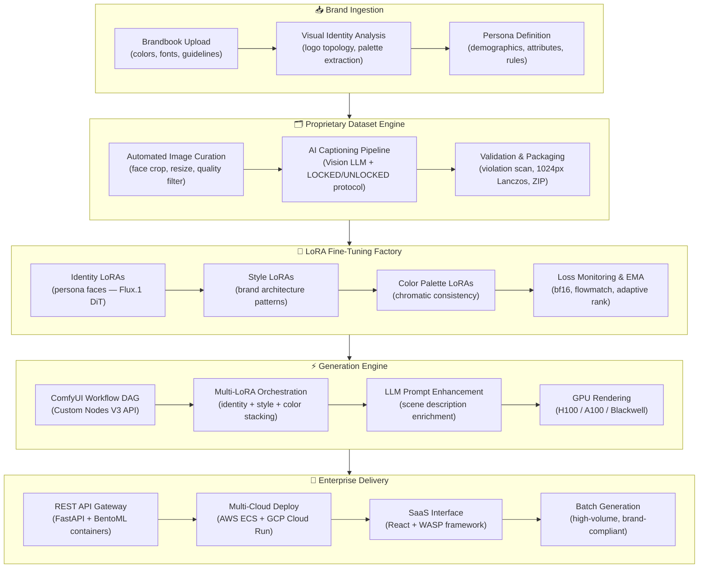
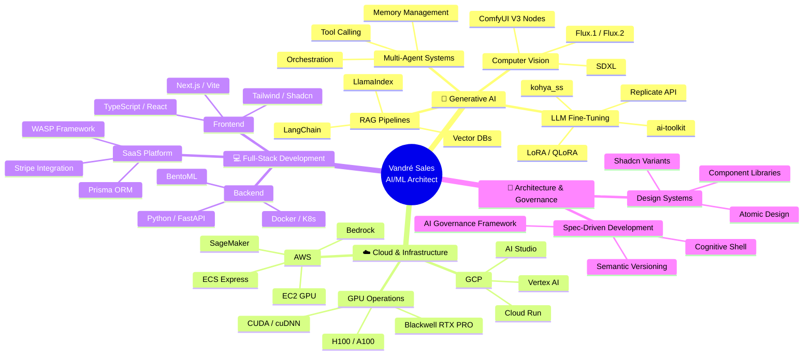
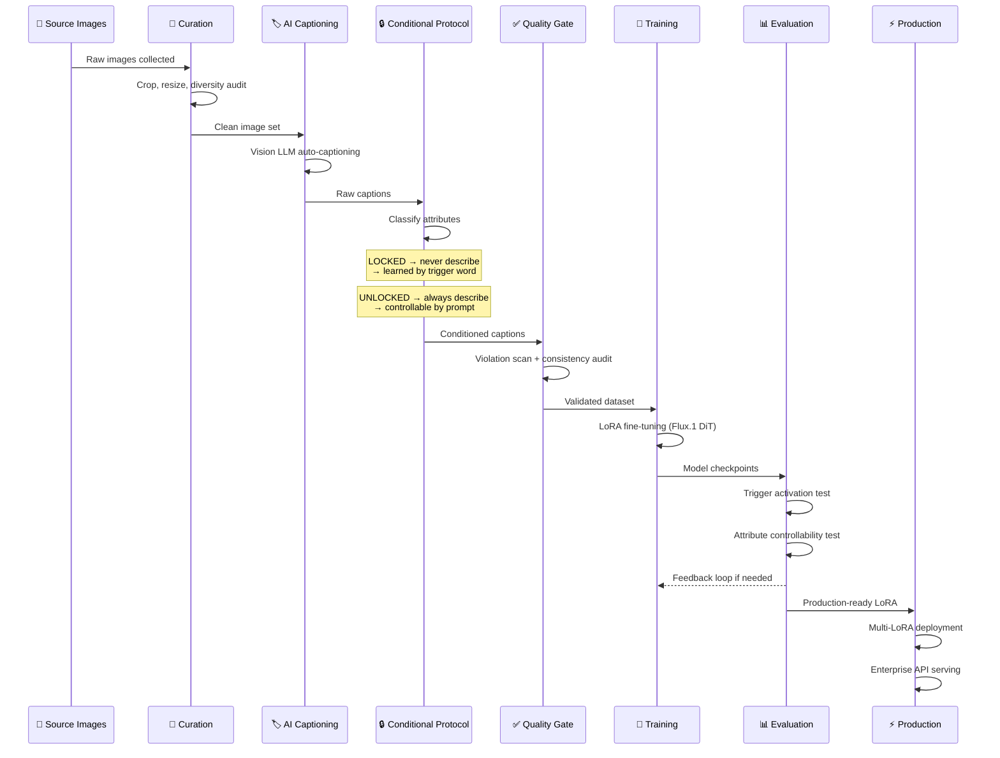
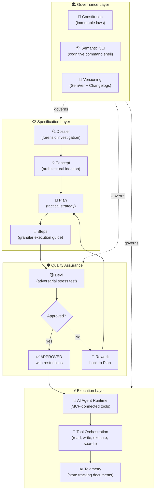
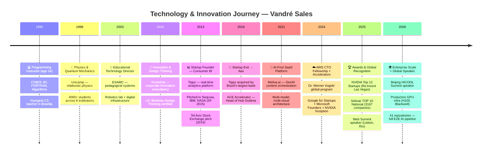

# 👋 Hi, I'm Vandré Sales

**AI/ML Architect** specializing in Multi-Agent Systems, Generative AI, and Production ML Infrastructure.

---

## 🎯 What I Build

Enterprise clients like Porto Seguro (15M customers) and RD Saúde/Drogasil needed to scale personalized visual asset production without 5× their creative teams. I architected a platform that orchestrates the entire lifecycle — from brand ingestion to mass generation via API — with clear separation of concerns: **security** in data handling, **efficiency** in GPU processing, and **governance** across the pipeline.

---

## 🏗️ How I Think

---

## 💻 How I Engineer

When building LoRAs for enterprise persona identity at scale, I discovered the bottleneck isn't training — it's dataset preparation. A poorly written caption destroys LoRA consistency. I developed a proprietary end-to-end process with a conditional captioning protocol (LOCKED/UNLOCKED) that mathematically guarantees permanent attributes are absorbed by the trigger word while variable attributes remain prompt-controllable.

---

## 👔 How I Lead

Coordinating multiple AI projects simultaneously (SaaS, GPU infra, LoRA training, APIs), I realized the biggest risk wasn't technical — it was **cognitive entropy** between work sessions with AI agents. Each session started from zero: no memory, no context, no governance. I created a spec-driven agentic development framework where every action is preceded by formal specification, validated by adversarial QA, and versioned with full traceability. The AI agent operates as runtime; the framework governs.

---

## 🗺️ My Journey

---

## 📌 Featured Projects

| Project | Description | Tech |
|---------|-------------|------|
| [**MLV_Nodes_V3**](https://github.com/vandre-sales/MLV_Nodes_V3) | ComfyUI Custom Nodes V3 — LoRA Stack, Ollama Generate, DCE Pipeline | Python |
| [**MLV_Combo_Nodes**](https://github.com/vandre-sales/MLV_Combo_Nodes) | Dynamic prompt builder + LOCKED/UNLOCKED LoRA captioning | Python |
| [**proto-mcp-server**](https://github.com/vandre-sales/proto-mcp-server) | AI Governance Framework as MCP Server — spec-driven development | TypeScript |
| **41 repositories** | Full pipeline: Dataset→LoRA→Inference→API→Product | Multi-lang |

---

## 🏆 Awards & Recognition

**Big Tech Partners:**

**🌍 Global Presence (Speaker / Exhibitor):**
-  San Francisco — Sequoia / IBM / NASA pitch (2015)
-  Tel Aviv — Stock Exchange pitch (2016)
-  Lisbon — Web Summit (2023 & 2025, APEX Top 80 BR startups)
-  São Paulo — Google / AWS / Microsoft accelerated
-  Rio de Janeiro — Web Summit (2024 & 2025)
-  Las Vegas — NVIDIA Top 12 speaker, Re:Invent (2025)
-  Beijing — HICOOL Summit speaker (2025)

---

## 📫 Connect

- 🔗 [LinkedIn](https://linkedin.com/in/vandresales) — Open to opportunities
- 🌐 [meliva.ai](https://meliva.ai) — AI-powered content platform
- 📧 vandre.sales@gmail.com

---

*"Credentials without visibility are like code without deploy — they exist, but generate no value."*
